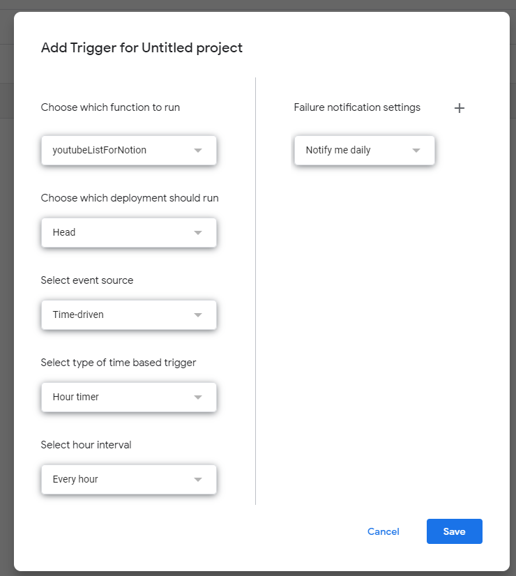

# Youtube List for Notion

This tool was created to automatically manage my Youtube videos in Notion using GoogleAppscript.

In order to use this tool, you need to register the following application

- Youtube
- [Notion](https://www.notion.so/ja)

Each application can be used for free, and we have confirmed that this tool works within the free range.(however, it may no longer be available for free due to changes in the terms and conditions of each application).

Also, since this application runs automatically on GoogleAppscript, does not matter which OS you set up (as long as you are connected to the Internet).
Once you run it, will run automatically semi-permanently unless you stop it.

## Purpose of Use

Are you frustrated with the way Youtube Studio displays things?

- Slow in operation
- Can only be displayed in list format
- URLs and videos can only be viewed by going to the individual video page

This tool may solve these problems.

Notion uses database functions to display a variety of data in various layouts.

For example,
- gallery_view
  

- gallery_view(time)
  

- board_view
  

- table_view
  

And, click on the page you want to check to see the video and detailed information in detail.

## Workflow

- WorkFlow Image
  

### Why use a spreadsheet?

Because the data is intended for secondary use.

This tool does not capture views or likes, but you may want to analyze the number of views and likes in the future

In addition, updates to Notion are managed in a spreadsheet. (column=updateflg)
Because appscript defines the maximum time limit for an instance, it is controled so that only necessary data is updated in Notion(add or update 50 items in one run).

## How to Setup

1. Create a new spreadsheet in Google Drive.
Column names can be arbitrary, but the data in each column will be output to a specific column.

   - A : Your youtube Id
   - B : The date you uploaded to YouTube
   - C : Open type(public or private or unlisted ...)
   - D : Your youtube content(video) Id
   - E : Youtube contents title
   - F : Youtube contents detail
   - G : Youtube contents URL
   - H : Youtube contents thumbnail
   - I : The date this tool added the content to the spreadsheet
   - J : Update flag to Notion

2. Rename the sheet in your spreadsheet to "List."

3. Click on 'Extensions/Appscript' in the toolbar and create an Appscript (if you are logged in to Google with an account other than your main account, the Appscript may not open properly. In that case, please log out of all accounts, log in again, and try again).
   
4. Copy the file name and contents of this source. (You may use any name you like for the file name.)
   

5. Open the spreadsheet again, copy the following part of the URL, and set it to `constant.gs/sheet_ID` in Appscript.
      
   ---
   
   
6. Open Notion and add a page. If you haven't created [Notion](https://www.notion.so/), create one.

7. Create a database and set the following properties and Type. The order of the columns can be in any order. You may add other properties than those listed below.
   
	|  Property_name | Type |
	| --- | --- |
	| title | title |
	| uploadymd | Date |
	| open_type | Multi-select |
	| detail | Text |
	| videoid | Text |
	| url | URL |
	| thumbnails | Files & media |
	| execute_date | Date |

   
   ---
   

8. Open the database in full page and copy the area circled in red in the figure below.
   
   ---
   

9. Set to `constant.gs/nt_DB_ID` in Appscript.
   

10.  Open [My Creator Profile | Notion](https://www.notion.so/profile/integrations) and create an integration.
   

11.  Copy 'Internal Integration Secret' and set it to `constant.gs/nt_token` in Appscript.
   
   ---
   

12. Return to your database page in Notion and set up Integration
    

13. Open `000_main.gs` in Appscript and execute Run
   

14. 'Authorization required' comes up, click 'Review permissions'
   

15. Select your account in 'Choose an account'
   

16. If you see 'Click on 'Google hasn't verified this app', click 'Advanced', then 'Go to xxx project(unsafe)', then 'Allow' on the next message.
   
   ---
   
   ---
   

17. Click on 'Services', select 'Youtube Data API v3', select Add
   
   ---
   

18. When you execute ''Run,'' you will get the same message as in ''14.'' Repeat 14.~16.
19. Pressing 'Run' again will reflect the data in SpreadSheet and Notion. (If the data is reflected in SpreadSheet but not in Notion, set all the updateflg columns in SpreadSheet to 1 and run again.)
   
   ---
   

20. Click on Trriger, select Add Trigger, and set the time to run this appscript as follows to complete the configuration
   
   ---
   
   ---
   

21. You can then delete the rows you don't want in the Notion, adjust the Notion date format, create a view other than the table view, manage it with tags, and adjust it to your liking!

## 注意

- Due to appscript limitations, instances cannot be run for long periods of time (maximum run time is about 5 minutes). Therefore, if you already have a large amount of data stored in youtube, data will be added to Notion 50 times per appscript. you will need to set a trigger and wait a day until all data is reflected in Notion, or set the trigger time at 10 minute intervals, etc. (You do not need to worry about this, as only the differences are reflected for data other than the first time).